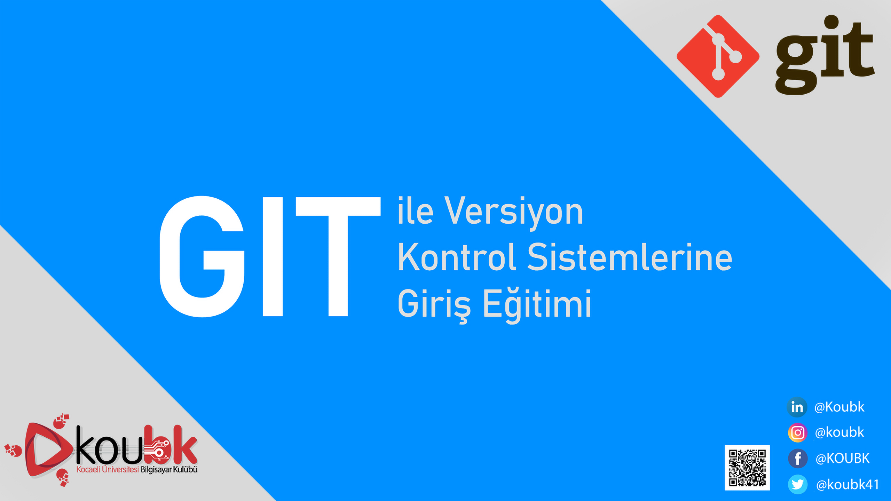

# Git ile Versiyon Kontrol Sistemlerine Giriş Eğitimi

Bilgisayar Bilimlerinde ve temelde ekip olarak çalışmayı gerektiren her türlü dijital çalışmada versiyon kontrolünün verimli olarak yapılabilmesi için VCS (Version Control System)'ler kullanılır. En yaygın Versiyon Kontrol Sistemi olan "Git"i altı hafta kadar bir sürede anlatmayı hedefleyen bu eğitimin içeriğine buradan ulaşabilirsin.

## Derste kullanılan slaytlar
🎈 [Birinci hafta](https://docs.google.com/presentation/d/1KO8MOLoMJLw2Ad7dqzdqjdkJkpQBWtmsovAPVsPC4ZQ/edit?usp=sharing)

🎈 [İkinci hafta](https://docs.google.com/presentation/d/1n_XNY_QVmnvq1MesjouKgINfPechc1BtijuS1u7VcoI/edit#slide=id.g70a2fa3131_0_0)

🎈 [Üçüncü hafta](https://docs.google.com/presentation/d/1quzUnoZ3n-lcjd06VkxnA3DzSQq7palurpBSZ7-p9w4/edit#slide=id.g75a5d087a9_0_3)

🎈 [Dördüncü hafta](https://docs.google.com/presentation/d/1CecYaPSBPtfFZ9Sb4N3zllXCxjjILhqjx3Cu4WMYE2k/edit#slide=id.g6bd9a1f03f_0_6)

🎈 [Beşinci hafta](https://docs.google.com/presentation/d/138yzo-alfRxuA3mFYIPrlpNo0r0fR4cAnLRxfh_f8IQ/edit#slide=id.g6c4fbb9376_0_0)
